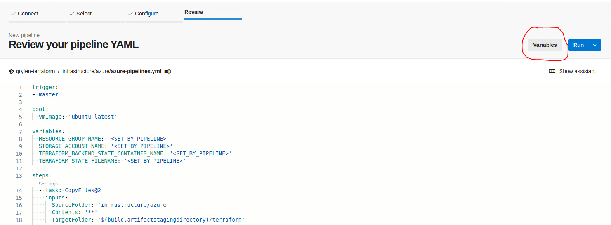
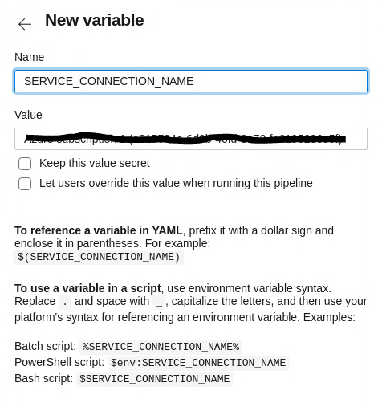

# Gryfen
Testing things...

## Setup Azure Environment using Azure CLI & Terraform
### CI/CD
 * Create a new Azure DevOps project
 * Create a new [Service Connection](https://docs.microsoft.com/en-us/azure/devops/pipelines/library/service-endpoints?view=azure-devops&tabs=yaml#create-a-service-connection)
   * The type should be a new [Azure Resource Manager using service principal authentication](https://docs.microsoft.com/en-us/azure/devops/pipelines/library/service-endpoints?view=azure-devops&tabs=yaml#sep-azure-resource-manager)
   * Note the 'Service connection name'
 * Setup a new YAML Pipeline based off [infrastructure/azure/azure-pipelines.yml](infrastructure/azure/azure-pipelines.yml)
 * Create a new variable named 'SERVICE_CONNECTION_NAME' with the value setup for the 'Service connection name'
   *  
   *  

### Local
Container credit to: https://github.com/Zenika/terraform-azure-cli

Launch the container which contains the Azure CLI and Terraform, passing it our [init script](infrastructure/azure/init_local):

```bash
cd infrastructure/azure
docker container run -it --rm --mount type=bind,source=$PWD,target=/workspace zenika/terraform-azure-cli:latest ./init_local ../env/dev.tfvars.json true|false
cd mutable|immutable # Depending on which type of infrastructure you are trying to initialize
terraform apply -var-file=./global.tfvars.json -var-file=../env/dev.tfvars.json
terraform destroy -var-file=./global.tfvars.json -var-file=../env/dev.tfvars.json
```

You can also run the container without the script to have full console access inside the container:

```bash
cd infrastructure/azure
docker container run -it --rm --mount type=bind,source=$PWD,target=/workspace zenika/terraform-azure-cli:latest
```
